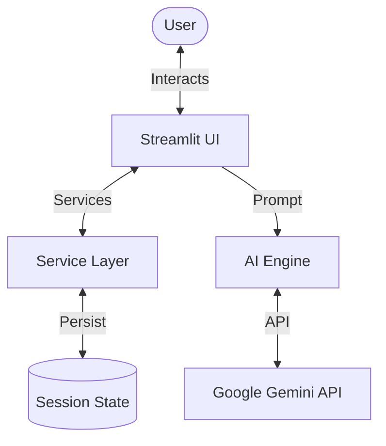

# ProductivityAgent: Asistente Inteligente De Productividad Personal

An AI-powered productivity assistant designed to help you manage goals, track habits, and optimize your schedule using the power of **Google Gemini**.

---

## Key Features

- **Intelligent Chat Interface**: Interact with your productivity assistant in natural language.
- **Goal Management**: Define and track your short-term and long-term objectives.
- **Habit Tracking**: Get AI-suggested habits based on your goals and stay consistent.
- **Smart Scheduling**: Let the AI handle your calendar and schedule events automatically through chat.
- **Real-time Feedback**: Interactive dashboards for monitoring your progress.
- **Privacy First**: Your data stays local in your session state.

---

## 🏗️ Architecture Overview

The application follows a clean **Client-Server-AI** architecture:

1.  **UI (Streamlit)**: Providing a responsive and modern interface.
2.  **Service Layer**: Handles the business logic for Goals, Habits, and Calendar management.
3.  **AI Engine**: Integrates with Google's Gemini API for natural language understanding and smart action suggestions.
4.  **State Management**: Uses Streamlit's session state for reliable temporary data persistence.



---

## 🛠️ Getting Started

### Prerequisites

- **Python 3.8+**
- **Google Gemini API Key**: Obtain one from [Google AI Studio](https://aistudio.google.com/).

### Installation

1.  **Clone the repository**:

    ```bash
    git clone https://github.com/SebasCordero15/ProductivityAgent.git
    cd ProductivityAgent
    ```

2.  **Install dependencies**:
    ```bash
    pip install -r requirements.txt
    ```

### Configuration

Create a `.env` file in the root directory and add your API key:

```text
GOOGLE_API_KEY=your_gemini_api_key_here
```

_Note: You can also enter the API key directly in the application's sidebar._

### Running the App

```bash
streamlit run app.py
```

---

## 📂 Project Structure

- `app.py`: The main conductor and UI entry point.
- `services/`: Contains logic for Goal, Habit, and Calendar services.
- `utils/`: AI engine integration logic.
- `project_documentation.md`: Detailed technical deep-dive.
- `requirements.txt`: Project dependencies.

---

## 🤝 Contributing

Contributions are welcome! If you have suggestions for new features or improvements, feel free to open an issue or submit a pull request.

---

## ⚖️ License

This project is licensed under the MIT License - see the [LICENSE](LICENSE) file for details.
